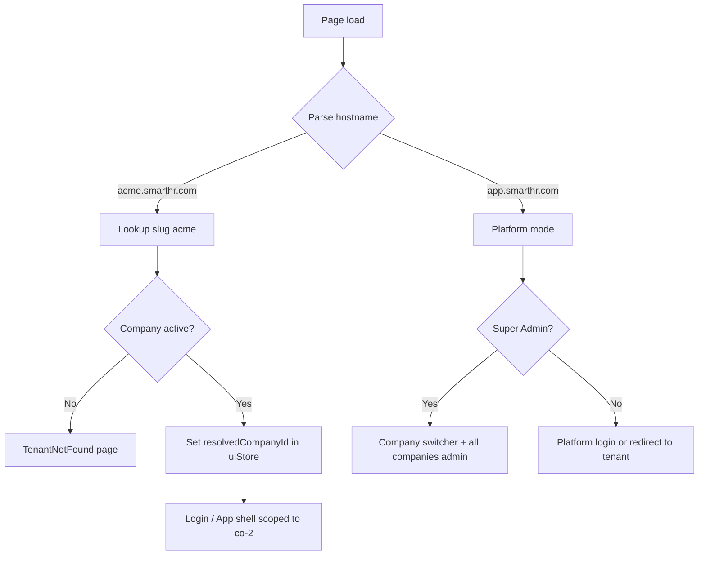

# Spec 22b — Subdomain Tenancy & Tenant Resolution (Phase 2)

## Goal

Extend Spec 22 multi-company tenancy with **hostname-based tenant routing** so
each customer gets a branded workspace at `{slug}.smarthr.com` (production) or
`{slug}.localhost` (development). Users sign in on their company subdomain; data
is scoped to that tenant without relying on a Super Admin switcher.

**Phase 2 spec — depends on Spec 22 (implemented).**

Builds toward sellable HRIS SaaS. Custom domains (`hr.acme.com`) remain a
separate future spec (22c or Phase 3).

---

## Problem (post–Spec 22)

Spec 22 isolates data by `companyId` but resolves tenant context from:

- `authStore.user.companyId` (HR Admin / Employee)
- `uiStore.activeCompanyId` (Super Admin switcher)

All tenants share one app origin. That works for a platform operator demo but
not for customer-facing SaaS where Acme employees expect `acme.smarthr.com`.

---

## Architecture Decisions

### URL model

| Host | Purpose |
| ---- | ------- |
| `app.smarthr.com` | Platform hub — Super Admin, marketing signup, company directory |
| `{slug}.smarthr.com` | Tenant workspace — login + full HRIS for one company |
| `localhost:5173` | Dev default — behaves as platform (`app`) unless overridden |
| `{slug}.localhost:5173` | Dev tenant subdomain (via `/etc/hosts` or Vite allowedHosts) |

**Reserved slugs** (cannot be registered): `www`, `app`, `api`, `admin`,
`login`, `register`, `static`, `cdn`, `mail`, `support`, `help`, `docs`,
`status`, `billing`.

### Tenant resolution priority

Update `getActiveCompanyIdSync()` resolution order:

1. **Hostname tenant** — parse subdomain → lookup company by `slug` → `companyId`
2. **Authenticated user** — `user.companyId` (must match hostname tenant if both set)
3. **Super Admin override** — `uiStore.activeCompanyId` (platform host only)
4. **Fallback** — `DEFAULT_COMPANY_ID` (`co-1`)

On a tenant subdomain, Super Admin switcher is **hidden**; context is fixed
to the resolved tenant (platform operators use `app.` host + switcher).

### Auth rules

- Login on `acme.smarthr.com` only succeeds for users with `companyId` matching
  Acme (`co-2`). Wrong tenant → *"This account belongs to another organization."*
- Register on platform (`app.`) creates company + slug + redirects to new
  subdomain login.
- Register on tenant subdomain is **disabled** (redirect to platform signup).
- JWT / session payload includes `companyId`; mock API validates hostname tenant
  matches token on every request (future real backend: middleware).

### Branding

- Tenant subdomain login page shows company name + logo from
  `getCompanySettings(companyId)` (Spec 13).
- Platform login remains generic SmartHR branding.

### Frontend-only (v1) mock strategy

No real DNS or wildcard TLS in this spec. Simulate subdomains via:

- `window.location.hostname` parsing utility
- Dev: `VITE_PLATFORM_HOST=localhost` and optional query override
  `?tenant=acme` for quick testing without `/etc/hosts`
- Mock `resolveTenantFromHost()` in `companies.api.ts` using existing
  `companyStore` + slug index

Production deployment notes documented for future infra; not implemented in repo.

---

## Tenant Resolution Flow



---

## Routes

No new product modules. Add **guard pages** and adjust auth entry:

| Path | Page | Host | Notes |
| ---- | ---- | ---- | ----- |
| `/login` | `LoginPage` | both | Tenant-branded on subdomain |
| `/register` | `RegisterPage` | platform only | Redirect to platform if on tenant host |
| `/tenant-not-found` | `TenantNotFoundPage` | tenant | Unknown or inactive slug |
| `/settings/companies` | `CompaniesPage` | platform only | Super Admin company CRUD |

Existing app routes unchanged; all inherit resolved tenant context.

---

## File Structure

```
src/
├── config/
│   └── tenant.config.ts              ← platform host, reserved slugs, dev overrides
├── utils/
│   └── tenant.utils.ts               ← parseSubdomain(), isPlatformHost()
├── store/
│   └── uiStore.ts                    ← add resolvedTenant: { slug, companyId } | null
├── hooks/
│   └── useTenant.ts                  ← React hook for tenant context + branding
├── components/
│   └── tenant/
│       ├── TenantProvider.tsx        ← resolve on boot, block app if invalid tenant
│       └── TenantNotFoundPage.tsx
├── api/
│   ├── companies.api.ts              ← getCompanyBySlug(), resolveTenantFromHost()
│   └── auth.api.ts                   ← login validates user.companyId vs resolved tenant
├── pages/Auth/
│   ├── LoginPage.tsx                 ← tenant branding when on subdomain
│   └── RegisterPage.tsx              ← platform-only guard
└── utils/
    └── company-context.utils.ts      ← hostname-first getActiveCompanyIdSync()
```

---

## Types & Config

### `tenant.config.ts`

```ts
export const PLATFORM_HOSTS = ['app.smarthr.com', 'localhost'] as const
export const TENANT_DOMAIN_SUFFIX = import.meta.env.VITE_TENANT_DOMAIN_SUFFIX ?? 'localhost'
export const RESERVED_SLUGS = ['www', 'app', 'api', ...] as const
export const DEV_TENANT_QUERY_PARAM = 'tenant' // ?tenant=acme on localhost
```

### Extend `uiStore`

```ts
resolvedTenant: { slug: string; companyId: string } | null
setResolvedTenant: (tenant: { slug: string; companyId: string } | null) => void
```

Persist `resolvedTenant` **only for current session** (not localStorage) — it
must re-derive from hostname on each load.

### `companies.api.ts` additions

```ts
getCompanyBySlug(slug: string): Promise<Company | null>
resolveTenantFromHost(hostname: string): Promise<{ slug: string; companyId: string } | null>
```

Return `null` for platform hosts. Throw / return inactive status for
`status: 'inactive'` companies.

---

## UI Changes

### Login (tenant subdomain)

- Show company logo + name in left panel (from company settings).
- Subtitle: *"Sign in to {company.name}"*.
- Hide "Create account" link → point to `https://app.smarthr.com/register`.

### Login (platform)

- Generic SmartHR branding (current behavior).
- Optional: "Find your workspace" input — enter slug → redirect to
  `https://{slug}.smarthr.com/login`.

### Topbar

- **Platform + Super Admin:** keep company switcher (unchanged).
- **Tenant subdomain:** hide switcher; show read-only company name badge.
- **Tenant + wrong user:** logout + error if `user.companyId !== resolvedTenant.companyId`.

### Register (platform only)

After successful register (Spec 22):

1. Show success: *"Your workspace is ready at acme.smarthr.com"*.
2. CTA button links to `https://{slug}.{domain}/login`.
3. Dev: link to `http://acme.localhost:5173/login` or `?tenant=acme`.

---

## API / Mock Changes

| Area | Change |
| ---- | ------ |
| `auth.api.login` | If `resolvedTenant` set, reject when `user.companyId !== resolvedTenant.companyId` |
| `getActiveCompanyIdSync` | Hostname tenant takes precedence over user/switcher on tenant hosts |
| `companies.api.createCompany` | Reject slug in `RESERVED_SLUGS`; return suggested subdomain URL |
| All scoped APIs | No change if `getActiveCompanyIdSync()` is updated centrally |
| Axios interceptor (future) | Send `X-Tenant-Id` or `X-Tenant-Slug` header for real backend |

---

## Local Development

Document in spec README / `context/architecture.md` (implementation task):

1. **Query param (easiest):** `http://localhost:5173/login?tenant=acme`
2. **Hosts file:**
   ```
   127.0.0.1 acme.localhost
   127.0.0.1 app.localhost
   ```
   Vite `server.host: true`, `server.allowedHosts: ['.localhost']`
3. **Env:** `VITE_PLATFORM_HOST=localhost`

---

## Production Deployment (documentation only)

Not implemented in frontend repo; capture for backend/infra team:

- Wildcard DNS: `*.smarthr.com` → app CDN / ingress
- TLS wildcard cert for `*.smarthr.com`
- Ingress routes all tenant hosts to same SPA bundle
- Tenant resolution in edge middleware (optional) + API validation
- Rate limiting per tenant slug on login

---

## Out of Scope (Spec 22b)

- Custom domains per company (`hr.acme.com`) — Spec 22c
- Billing, plan enforcement, trial expiry
- Automatic DNS provisioning for customer domains
- SSL certificate management for custom domains
- Cross-subdomain SSO / central identity provider
- White-label email (`noreply@acme.com`)
- Tenant-specific feature flags beyond plan field

---

## Acceptance Criteria

1. Visiting `acme.localhost:5173/login` (or `?tenant=acme`) shows Acme branding
   and only allows Acme users to sign in.
2. SmartHR user (`admin@smarthr.com`) cannot log in on Acme subdomain.
3. Acme user (`admin@acme.com`) cannot log in on platform host without explicit
   tenant override (redirect to `acme.` login suggested).
4. Platform Super Admin at `app.` host retains company switcher; tenant hosts hide it.
5. Register on platform creates company and displays subdomain URL for new tenant.
6. Unknown slug shows `TenantNotFoundPage` (not a blank app or co-1 data leak).
7. Inactive company slug shows suspended message; no HRIS data accessible.
8. `getActiveCompanyIdSync()` returns hostname-resolved id on tenant hosts for
   all modules (employees, payroll, reports, etc.).
9. `npm run build` passes with zero TypeScript errors.

---

## Test Plan (manual)

| Step | Action | Expected |
| ---- | ------ | -------- |
| 1 | Open `?tenant=acme` → login as `admin@acme.com` | Acme employees only |
| 2 | Same URL → login as `admin@smarthr.com` | Error: wrong organization |
| 3 | Platform login as `super@smarthr.com` | Switcher works, both companies |
| 4 | `?tenant=unknown` | Tenant not found page |
| 5 | Register new company on platform | Success shows `{slug}.` URL |
| 6 | Navigate modules on Acme tenant | No SmartHR Inc. employees visible |

---

## Dependencies & Order

| Spec | Relationship |
| ---- | ------------ |
| **22** | Required — `companyId`, slug, register, scoping |
| **13** | Tenant login branding uses company settings |
| **23** | Independent — can ship before or after custom roles |
| **22c** (future) | Custom domains builds on 22b hostname resolution |

**Recommended priority:** After Spec 22, before or parallel with Spec 23 if SaaS
go-to-market is prioritized over custom roles.

---

## Migration Notes (Spec 22 → 22b)

- Existing `uiStore.activeCompanyId` remains for platform Super Admin.
- Add `resolvedTenant` separately; do not conflate with switcher state.
- `DEFAULT_COMPANY_ID` fallback only on platform host — never on tenant host
  (prevents silent data leak to co-1).
- Update session notes / mock credentials with tenant URLs in progress tracker.
